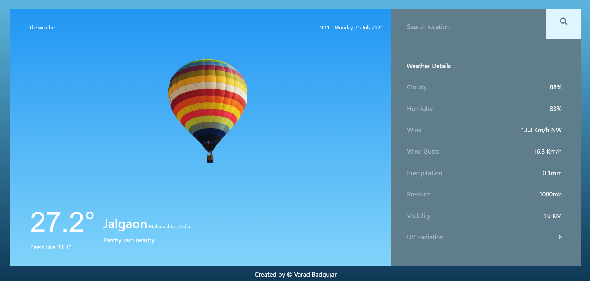

<h2 align="center">
  Weather Web Application
</h2>

  

# TheWeatherApp
This is a API based Weather Page where it fetches weather data from [weatherapi](https://www.weatherapi.com/) in JSON Format and display the data.

## Tech Used 
- HTML
- CSS
- JS
- APIs
